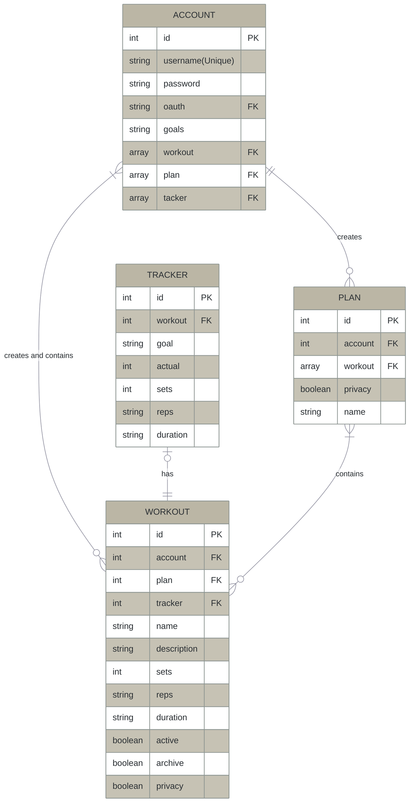

# Entity Relationship Diagram 

```mermaid
%%{ 
	init: {
		'theme': 'base',
		'themeVariables': {
			'primaryColor': '#BBB6A5',
			'primaryTextColor': '#2A2F33',
			'primaryBorderColor': '#8C9491',
			'lineColor': '#8C8C9C',
			'secondaryColor': '#8C9491',
			'tertiaryColor': '#fff'
		}
	}
}%%
erDiagram
    ACCOUNT ||--o{ PLAN : creates
    ACCOUNT }|--o{ WORKOUT : "creates and contains"
    ACCOUNT {
	    int id PK
	    string username(Unique)
		string password 
		string oauth FK
	    string goals
	    array workout FK
	    array plan FK
		array tacker FK
    }
	TRACKER |o--|| WORKOUT : has
	TRACKER {
		int id PK
		int workout FK
		string goal
		int actual
		int sets
		string reps
		string duration
	}
    PLAN }|--o{ WORKOUT : contains
    PLAN {
	    int id PK
	    int account FK
	    array workout FK
	    boolean privacy
	    string name
	}
    WORKOUT {
	    int id PK
	    int account FK
	    int plan FK
		int tracker FK
	    string name 
	    string description
		int sets
		string reps
		string duration
	    boolean active
        boolean archive
	    boolean privacy
	
    }

```