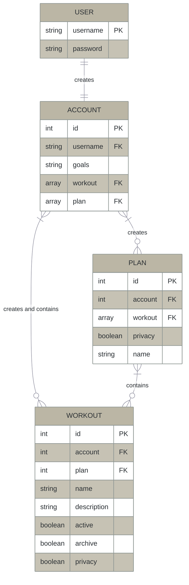

# Entity Relationship Diagram 

```mermaid
%%{ 
	init: {
		'theme': 'base',
		'themeVariables': {
			'primaryColor': '#BBB6A5',
			'primaryTextColor': '#2A2F33',
			'primaryBorderColor': '#8C9491',
			'lineColor': '#8C8C9C',
			'secondaryColor': '#8C9491',
			'tertiaryColor': '#fff'
		}
	}
}%%
erDiagram
    USER ||--|| ACCOUNT : creates
    USER {
	    string username PK
	    string password
    }
    ACCOUNT }|--o{ PLAN : creates
    ACCOUNT }|--o{ WORKOUT : "creates and contains"
    ACCOUNT {
	    int id PK
	    string username FK
	    string goals
	    array workout FK
	    array plan FK
    }
    PLAN }|--o{ WORKOUT : contains
    PLAN {
	    int id PK
	    int account FK
	    array workout FK
	    boolean privacy
	    string name
	}
    WORKOUT {
	    int id PK
	    int account FK
	    int plan FK
	    string name
	    string description
	    boolean active
        boolean archive
	    boolean privacy
    }

```