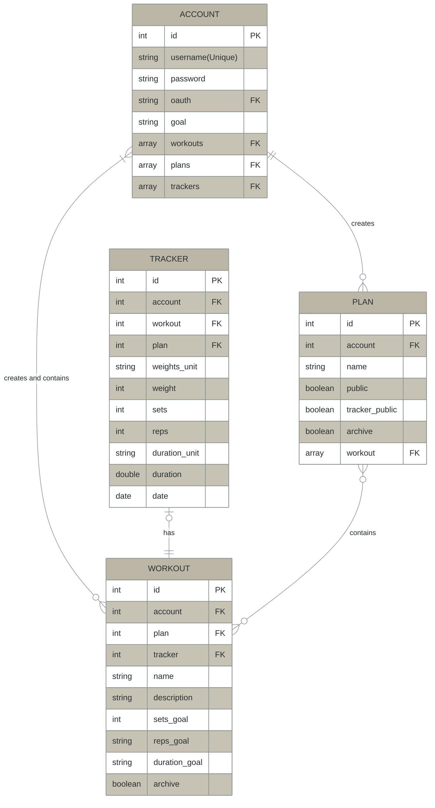

# Entity Relationship Diagram

# NOTES

## WORKOUT > boolean archive

Users may want to stop seeing it on their plan but don't want to lose what they have done in the past.

## PLAN > boolean public and tracker_public

This is so the user can make their plan public to show people what it is or they can copy it, but they don't want their personal history shared. Some people may want that open as an accountability.
