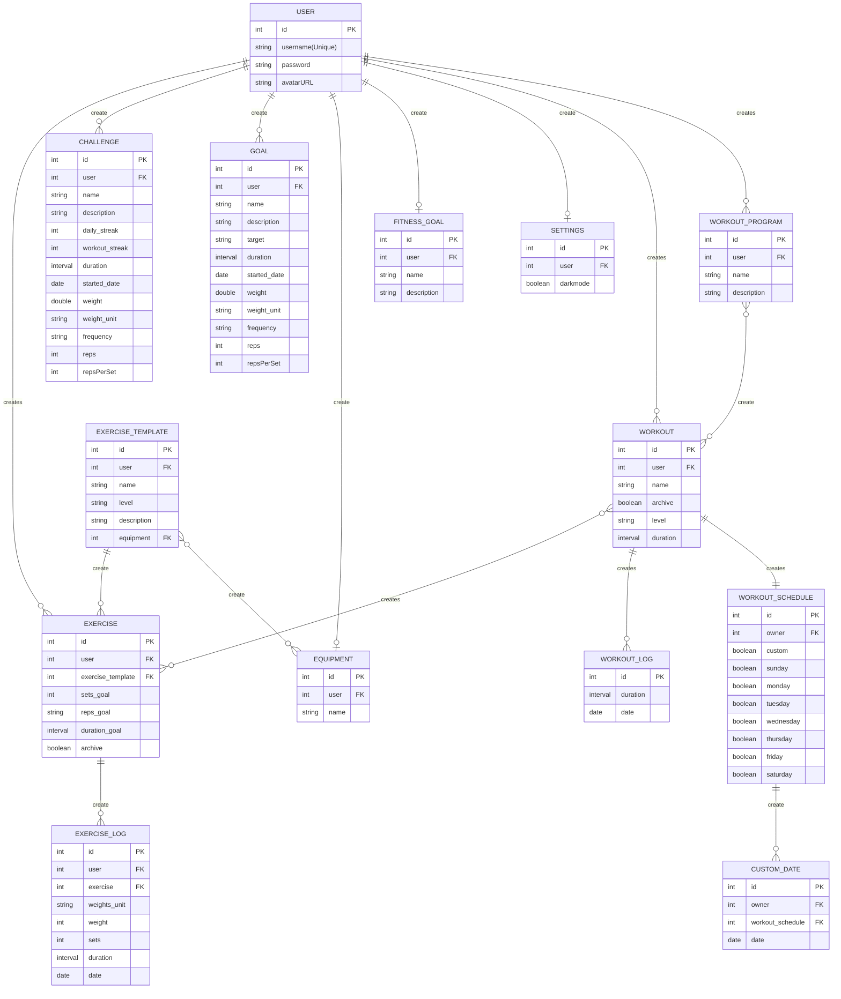

# Entity Relationship Diagram For Verson One

# NOTES

## Understanding the ERD

-  This is not a FK relationship ERD, it's overview on how the data relate to each other.
-  create - It only add to the table if it needs it.
-  Any many to many relationship are a joint table that just not put there to save space

## About Data Types

-  interval
   -  is not SQLite support
   -  will be a string type
   -  format DD:HH:MM:SS
-  date
   -  is not SQLite support
   -  will be a string type,
   -  function that SQLite have are
      -  https://www.sqlite.org/lang_datefunc.html
-  boolean
   -  is not SQLite support
   -  will be a int type,
   -  0 for false, 1 for true
   -  SQLite recognizes the keywords "TRUE" and "FALSE",

---

# Convertions

-  Weight
   -  all Weight are recorded in lb, and converted on frontend if need to be

## Nots on a Table

-  FITNESS_GOAL: This just name/heading discription/sub_heading that can go up on a flash screen to remind the user of whatever their over all goal is for exercising
-  SETTINGS will never be moved to a cloud for a vertion 2
