# Entity Relationship Diagram For Verson One

```mermaid
	erDiagram
		USER ||--o{ EXERCISE : creates
		USER ||--o{ CHALLENGE : create
		USER ||--o| FITNESS_GOAL : create
		USER ||--o| EQUIPMENT : create
		USER ||--o| SETTINGS : create
		USER ||--o{ WORKOUT : creates
		USER ||--o{ WORKOUT_PROGRAM : creates
		USER {
			int id PK
			string username(Unique)
			string password
			string avatarURL
		}
		SETTINGS {
			int id PK
			int user FK
			boolean darkmode
		}
		WORKOUT_PROGRAM }o--o{ WORKOUT : create
		WORKOUT_PROGRAM {
			int id PK
			int user FK
			string name
			string description
		}
		WORKOUT }o--o{ EXERCISE : creates
		WORKOUT ||--o{ WORKOUT_LOG : creates
		WORKOUT ||--|| SCHEDULE : creates
		WORKOUT {
			int id PK
			int user FK
			string name
			boolean archive
			string level
			interval duration
		}
		EXERCISE_TEMPLATE ||--o{ EXERCISE : create
		EXERCISE_TEMPLATE {
			int id PK
			int user FK
			string name
			string level
			string description
			int equipment FK
		}
		EXERCISE ||--o{ EXERCISE_LOG : create
		EXERCISE {
			int id PK
			int user FK
			int exercise_template FK
			int sets_goal
			string reps_goal
			interval duration_goal
			boolean archive
		}
			EXERCISE_LOG {
			int id PK
			int user FK
			int exercise FK
			string weights_unit
			int weight
			int sets
			int reps
			string duration_unit
			double duration
			date date
		}
		WORKOUT_LOG {
			int id PK
			interval duration
			date date
		}
		SCHEDULE {
			int id PK
			int owner FK
			boolean sunday
			boolean monday
			boolean tuesday
			boolean wednesday
			boolean thursday
			boolean friday
			boolean saturday
		}
		FITNESS_GOAL {
			int id PK
			int user FK
			string name
			string description
		}
		CHALLENGE {
			int id PK
			int user FK
			string name
			string description
		}
		EQUIPMENT {
			int id PK
			int user FK
			string equipment
		}
```

# NOTES

-  This is not a FK relationship ERD, it's overview on how the data relate to each other.
-  create - It only add to the table if it needs it.
-  Any many to many relationship are a joint table that just not put there to save space
-  SETTINGS will never be moved to a cloud for a vertion 2
-  boolean is not supported by expo-SQLite so bool will actoully be an int.
